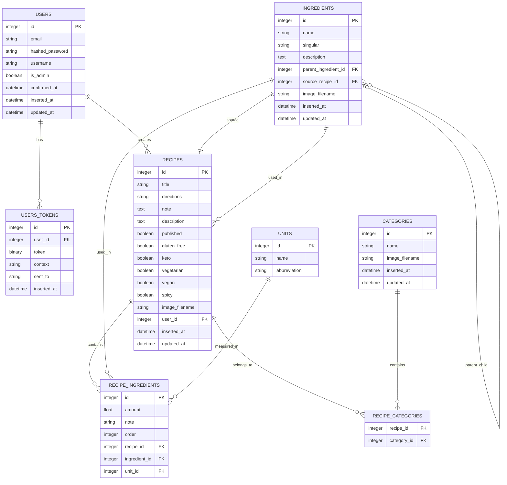

# Database Schema

```mermaid
erDiagram
    USERS {
        integer id PK
        string email
        string hashed_password
        string username
        boolean is_admin
        datetime confirmed_at
        datetime inserted_at
        datetime updated_at
    }

    USERS_TOKENS {
        integer id PK
        integer user_id FK
        binary token
        string context
        string sent_to
        datetime inserted_at
    }

    RECIPES {
        integer id PK
        string title
        string directions
        text note
        text description
        boolean published
        boolean gluten_free
        boolean keto
        boolean vegetarian
        boolean vegan
        boolean spicy
        string image_filename
        integer user_id FK
        datetime inserted_at
        datetime updated_at
    }

    INGREDIENTS {
        integer id PK
        string name
        string singular
        text description
        integer parent_ingredient_id FK
        integer source_recipe_id FK
        string image_filename
        datetime inserted_at
        datetime updated_at
    }

    UNITS {
        integer id PK
        string name
        string abbreviation
    }

    RECIPE_INGREDIENTS {
        integer id PK
        float amount
        string note
        integer order
        integer recipe_id FK
        integer ingredient_id FK
        integer unit_id FK
    }

    CATEGORIES {
        integer id PK
        string name
        string image_filename
        datetime inserted_at
        datetime updated_at
    }

    RECIPE_CATEGORIES {
        integer recipe_id FK
        integer category_id FK
    }

    %% Relationships
    USERS ||--o{ USERS_TOKENS : "has"
    USERS ||--o{ RECIPES : "creates"
    RECIPES ||--o{ RECIPE_INGREDIENTS : "contains"
    RECIPES ||--o{ RECIPE_CATEGORIES : "belongs_to"
    INGREDIENTS ||--o{ RECIPE_INGREDIENTS : "used_in"
    %% Self-referential: ingredients can have parent_ingredient_id referencing another ingredient
    INGREDIENTS |o--o{ INGREDIENTS : "parent_child"
    INGREDIENTS ||--|| RECIPES : "source"
    INGREDIENTS ||--o{ RECIPES : "used_in"
    UNITS ||--o{ RECIPE_INGREDIENTS : "measured_in"
    CATEGORIES ||--o{ RECIPE_CATEGORIES : "contains"
```
